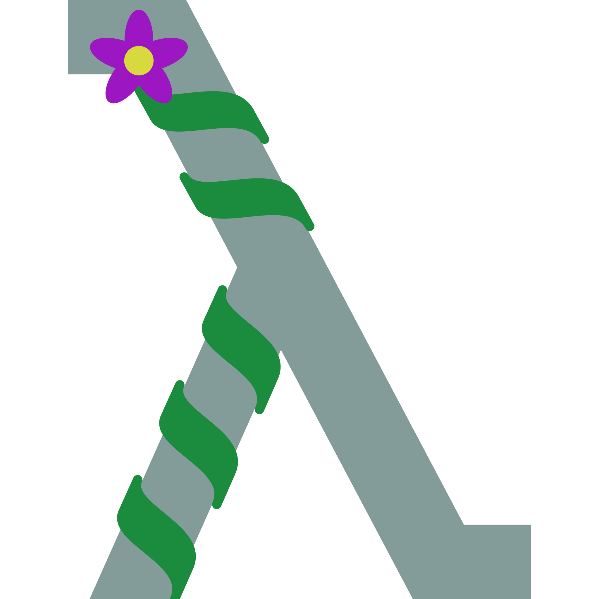

<h1 align="center">
  
  Orchid
</h1>

An experimental lazy, pure functional programming language designed to be embeddable in a Rust application for scripting.

## Usage

The standalone interpreter can be built as the binary target from this package. The language tutorial and standard library documentation is at [www.lbfalvy.com/orchid-reference](https://lbfalvy.github.io/orchid-reference/). Embedder guide and Rust API documentation are coming soon.

## Design

The execution model is lambda calculus, with call by name and copy tracking to avoid repeating steps. This leads to the minimal number of necessary reduction steps.

To make the syntax more intuitive, completely hygienic macros can be used which are applied to expressions after all imports are resolved and all tokens are namespaced both in the macro and in the referencing expression.

Namespaces are inspired by Rust modules and ES6. Every file and directory is implicitly a public module. Files can `export` names of constants or namespaces, all names in a substitution rule, or explicitly export some names. Names are implicitly created when they're referenced. `import` syntax is similar to Rust except with `(` parentheses `)` and no semicolons.

## Try it out

The project uses the nighly rust toolchain. Go to one of the folders within `examples` and run

```sh
cargo run --release
```

you can try modifying the examples, but error reporting for the time being is pretty terrible.

## The name

Orchids and mangrove trees form complex ecosystems; The flowers persuade the tree to grow in different ways than it normally would to provide better support for their vines, and kill fungi and other pests. The metaphor is about vines growing on a tree and moving branches into more optimal positions for other vines.

## Contribution

All contributions are welcome. For the time being, use the issue tracker to discuss ideas.

## Forks

The code in this repository is available under the GNU GPLv3, but identifying marks stored in the repository are restricted for use with an unmodified copy of this software. If you distribute modified versions of this software, you must either replace these identifying marks or modify them in a way that clearly indicates that what you are distributing is a derivative work and not this official vversion. You must also replace any contact information in such a way that your derivative work does not suggest that we may be contacted about issues. Your derivative work may use the original identifying marks and contact information to identify this project as its basis, while emphasizing that the authors of the original project are neither in control of, nor liable for the derivative work.

Identifying marks include the Orchid logo, the ribbon image above, and the names "Orchid", "Orchidlang" unless they are part of a technical interface.

Contact information includes email addresses, links to the source code and issue tracker.

Words listed as identifying marks are explicltly not considered as such when they appear in technical interfaces or APIs. For example, shell commands, identifiers within Orchid or Rust code, and names in package registries are not considered as identifying marks.
